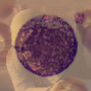

# Artificial Neural Networks and Deep Learning HW1 - AY 2024/2025
 
## Challenge: Blood Smear Classification

This challenge aimed to classify peripheral blood smears into eight categories using deep learning. We explored:

1. Custom CNNs
2. Transfer Learning (ImageNet)
3. Test Time Augmentation (TTA)

**Best approach:** Transfer Learning with ConvNeXt models.

## Data & Augmentation

Dataset: **13,758** images, with **1,799** duplicates removed. Maintaining the original class distribution provided the best results.

Key augmentations:
- Rotation, flipping
- Contrast, brightness adjustments
- Gaussian noise
- RandAugment pipeline

**Performance Boost:** VGG models improved from **0.61 → 0.72**, ConvNeXt from **0.88 → 0.93**.

## Models & Training

**Top models:** ConvNeXt > EfficientNet > VGG.
- **Transfer Learning:** Used pre-trained ImageNet weights.
- **TTA:** Applied but limited by Codabench constraints.
- **Hyperparameter Tuning:** Optimized learning rate, batch size.
- **Best optimizer:** NAdam.

**Final Results:** Accuracy **0.9427**, F1 **0.9385**.

## More Info

Refer to the [report](report.pdf) and [notebooks](/notebooks).

## Team
* [Mattia Piccinato](https://github.com/peetceenatoo)
* [Matteo Salari](https://github.com/matteo-salari)
* [Davide Salonico](https://github.com/DavideSalonico)
* [Federica Topazio](https://github.com/federicatopazio)
